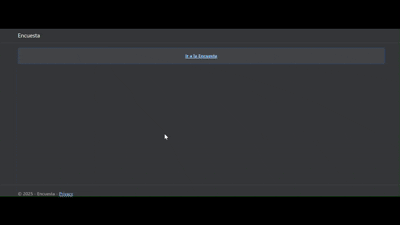

# Project:

Sample project with ASP.NET Core Razor Pages to manage surveys.

## Project Structure

## Demo

Here you can see how to access the survey. In particular, 3 fields are requested to be filled in, which can later be viewed and more surveys can be added. As a flow, there is an intermediate page thanking you for completing the survey and the possibility to access the responses.

## Technology Used

- ASP.NET Core 9.0 (Razor Pages)
- C#
- HTML5 and CSS3
- Bootstrap
- PlantUML
- VS Code
